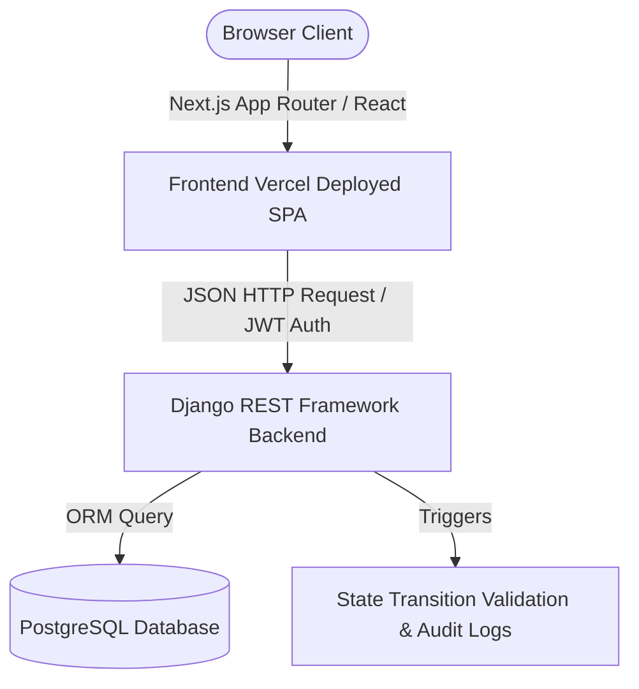
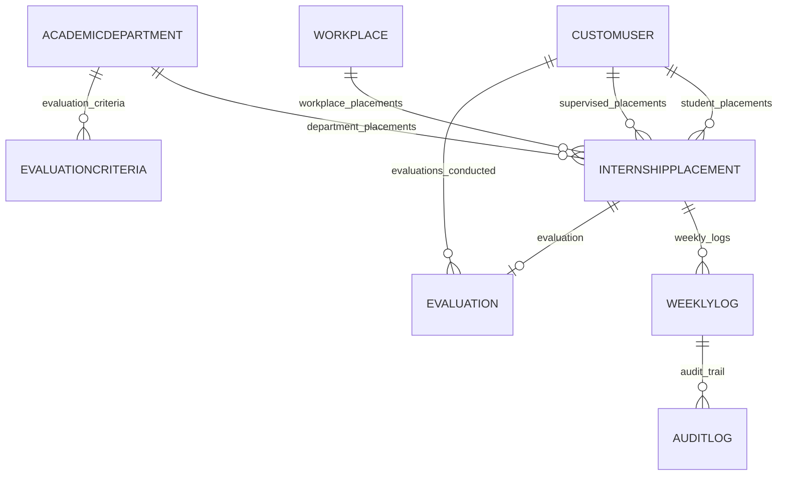

# Internship Logging & Evaluation System (ILES) — Group 3

Welcome to the official repository and submission documentation for the **Internship Logging & Evaluation System (ILES)**. This documentation provides a comprehensive report of the deployed application, system architecture, module details, testing verification, DevOps implementation, and lessons learned.

---

## 1. Functional Deployed System Details

### Live Access Details
* **Live System Frontend URL:** [https://internship-logging-system-group3.vercel.app](https://internship-logging-system-group3.vercel.app)
* **Live Backend API URL:** [https://internship-logging-system-project-group-3.onrender.com/api/](https://internship-logging-system-project-group-3.onrender.com/api/)
* **Database State:** Fully seeded & persisted PostgreSQL on Render.

### Test Credentials (Default Profiles)

| Role | Username / Email | Password | Access scope |
|---|---|---|---|
| **System Administrator** | `admin.intern@mak.ac.ug` | `admin.intern` | Placement Approval, Supervisor Registry, System-Wide Settings |
| **Academic Supervisor** | `jane.nakato@mak.ac.ug` | `Super@1234` | Log Approval, Performance evaluations, Student Grade Portfolios |
| **Workplace Supervisor** | `peter.ssemakula@mak.ac.ug` | `Work@1234` | Weekly Logbook Reviews, Workplace Performance Reviews |
| **Intern (Student)** | `daniel.otim@students.mak.ac.ug` | `Student@1234` | Daily Logging, Weekly Submissions, Performance Portfolio View |

---

## 2. Technical Architecture & Design Evidence

### System Architecture Diagram
The system utilizes a modern decoupled Single Page Application (SPA) architecture:



### Entity Relationship Diagram (ERD)
The database structure is normalized to enforce constraints and referential integrity:



---

## 3. Core Module Implementations

### 1. User & Role Management
* **Technical Details:** Extends Django's `AbstractUser` with custom role choices (`STUDENT`, `ACADEMIC_SUPERVISOR`, `WORKPLACE_SUPERVISOR`, `ADMIN`). Custom DRF permission classes (`IsAdmin`, `IsAcademicSupervisor`, `IsWorkplaceSupervisor`, `IsStudent`) restrict API access dynamically at the request level.
* **Authentication:** Stateless JWT Authentication with auto-refresh mechanism.
* **Workflow:** Admin registers academic and workplace supervisors, which triggers automatic credential activation.

### 2. Internship Placement Module
* **Technical Details:** Models students' attachment to workplaces, tying them to an academic supervisor and a workplace supervisor. Contains state machine logic governing placement statuses (`PENDING` -> `APPROVED`/`REJECTED` -> `ACTIVE` -> `COMPLETED`/`CANCELLED`).
* **Overlap Check:** Model `clean()` validation checks for overlapping start and end dates for a student before save.

### 3. Weekly Logbook Module
* **Technical Details:** Allows interns to record daily logs and submit them weekly.
* **States:** `DRAFT` -> `SUBMITTED` -> `REVIEWED` (under review) -> `APPROVED`/`REJECTED`. 

### 4. Supervisor Review Workflow
* **Technical Details:** Enables workplace supervisors to review weekly submissions, rate student performance on a weekly basis, and add qualitative feedback before approving/rejecting.

### 5. Academic Evaluation Module
* **Technical Details:** Enables academic supervisors to rate student performance across four categories, automatically compute grades, add qualitative remarks, and lock evaluations so they become visible to students.

### 6. Weighted Score Computation
* **Technical Details:** The system computes the evaluation grade dynamically based on active weighted criteria.
* **Formula Implementation (`backend/core/models.py`):**
  ```python
  def calculate_total_score(self):
      criteria = self.placement.academic_department.evaluation_criteria.filter(is_active=True)
      total = 0
      for criterion in criteria:
          category = criterion.category
          score = getattr(self, f"{category.lower()}_score", None)
          if score is not None:
              weight = criterion.weight / 100
              total += score * weight
      return round(total, 2)
  ```
  This is matched against a scale to assign the letter grade:
  * **90+:** A (Excellent)
  * **80-89:** B (Very Good)
  * **70-79:** C (Good)
  * **60-69:** D (Pass)
  * **<60:** F (Fail)

---

## 4. Testing & Debugging Evidence

### Unit Tests
* **Backend:** Django test suite built using standard `unittest` and `pytest`. Runs schema validation, transition checks, and permission security tests.
  * *Run command:* `python backend/manage.py test`
* **Frontend:** Jest test suite verifying mock API endpoints, dashboard routers, state management, and validation logic.
  * *Run command:* `npm run test`

### Debugging & Bug Fix Documentation (Before/After)

#### Bug Case 1: State Machine Transition Error (APPROVED → COMPLETED)
* **Error Traceback:** `django.core.exceptions.ValidationError: ["Invalid placement transition: 'APPROVED' → 'COMPLETED'. Allowed: ['ACTIVE', 'CANCELLED']."]`
* **Root Cause:** In the Django `pre_save` signal validation (`backend/core/signals.py`), placements in the `APPROVED` state were not allowed to transition directly to `COMPLETED` by the admin, causing the API to crash with a `500` error when marking approved internships completed.
* **Resolution:** Modified `valid_transitions` in `backend/core/signals.py` to allow this path:
  ```python
  'APPROVED':  ['ACTIVE', 'CANCELLED', 'COMPLETED'],
  ```

#### Bug Case 2: Django Model AttributeError on Evaluation Calculation
* **Error Traceback:** `AttributeError: 'InternshipPlacement' object has no attribute 'department'`
* **Root Cause:** The `calculate_total_score` method in the `Evaluation` model in `backend/core/models.py` queried `self.placement.department.evaluation_criteria`. However, the foreign key on `InternshipPlacement` is named `academic_department`, not `department`.
* **Resolution:** Corrected the query to use `self.placement.academic_department.evaluation_criteria`.

#### Bug Case 3: DRF ViewSet Filter FieldError
* **Error Traceback:** `FieldError: Cannot resolve keyword 'department' into field.`
* **Root Cause:** In `EvaluationViewSet` (`backend/api/views.py`), `'placement__department'` was listed under `filterset_fields`, which is an invalid relation path in the ORM schema.
* **Resolution:** Updated `filterset_fields` to `'placement__academic_department'`.

#### Bug Case 4: Serializer clean() triggers self-overlap check during updates
* **Error Traceback:** `ValidationError: Student already has an overlapping internship placement.`
* **Root Cause:** During a simple status update, `instance.save()` was called, triggering the full validation `clean()` method. Since the placement's status was changed to `COMPLETED` (which is in the active list), Django found the placement itself in the database and raised a duplicate overlap error.
* **Resolution:** Modified `PlacementStatusUpdateSerializer.update()` to use:
  ```python
  instance.save(update_fields=update_fields)
  ```
  This skips full validation calls on status-only changes.

---

## 5. Deployment & DevOps Evidence

### Hosting Architecture
* **Frontend:** Deployed to **Vercel** as a static Next.js production build for lightning-fast delivery.
* **Backend:** Deployed to **Render** Web Service (Python/Django WSGI server).
* **Database:** Deployed to **Render Postgres** database instance.
* **Security:** Configured CORS policies in backend `settings.py` to restrict resource access only to the Vercel app domain.

---

## 6. Reflections & Lessons Learned

### Member 1: Yalo2 (Backend & System Architecture)
* **Technical Lessons Learned:**
  * Implementing advanced model validation techniques in Django (like custom signal listeners and pre-save hooks) is essential for enforcing database integrity, but they must be carefully constructed to avoid deadlocks or blocking simple status updates (e.g., using `save(update_fields=...)` to skip overall validation).
  * Design patterns like custom Permission Classes in Django REST Framework allow clean encapsulation of Role-Based Access Control (RBAC).
* **Challenges Faced:**
  * Diagnosing state-machine transition blockages (e.g., transition from `APPROVED` directly to `COMPLETED`) where pre-save hooks rejected status transitions.
  * Overlap validation constraints matching placements with themselves during update requests.
* **Problem-Solving Approaches:**
  * Monitored container tracebacks and isolated serializer validate loops using targeted debug testing.

### Member 2: At-angella (Frontend UX/UI & State Management)
* **Technical Lessons Learned:**
  * Next.js App Router requires strict isolation between client-side and server-side components. Designing forms and dynamic tables defensively against asynchronous data fetch delays is critical.
  * Micro-animations and unified typography (Inter/Outfit) elevate the premium quality of the interface.
* **Challenges Faced:**
  * Handled alignment issues on dashboard cards and tables where mock data structures differed from real API JSON structures (e.g., nested objects versus raw IDs).
  * Preventing runtime JavaScript exceptions when rendering nested entities that could be null (e.g., `placement.academic_supervisor`).
* **Problem-Solving Approaches:**
  * Implemented strict TypeScript interfaces and fallback UI renders (like optional chaining `?.` and placeholder defaults) across all views.

### Member 3: Tech-valor (DevOps, Integration & Security)
* **Technical Lessons Learned:**
  * CORS errors are common but easily fixed by properly specifying origin headers in backend configurations.
  * Automated deployments on Vercel and Render require strict environmental environment variables (`JWT_SECRET`, `DATABASE_URL`, `USE_MOCK_DATA`) to align local environments with production.
* **Challenges Faced:**
  * Coordinating between Vercel's static router and Django's API paths on Render without introducing redirect loops.
  * Assuring database credential rotations on Render did not drop active sessions.
* **Problem-Solving Approaches:**
  * Configured production CORS policies using regex matches and verified integration using Postman collection test scripts.

### Member 4: mponyemathias (Quality Assurance, Testing & DB Schema)
* **Technical Lessons Learned:**
  * Automated regression testing is the only way to ensure frontend additions do not silently break existing backend API endpoints.
  * Writing comprehensive test cases using Pytest yields immediate value when debugging ORM logic like evaluation criteria calculations.
* **Challenges Faced:**
  * Reconciling differences between SQLite (used locally) and PostgreSQL (used in production) which occasionally handled query cases or index checks differently.
  * Writing unit tests for async states in React components.
* **Problem-Solving Approaches:**
  * Established independent test databases for local regression runs and verified JSON serializers returned precise keys matching frontend client needs.
